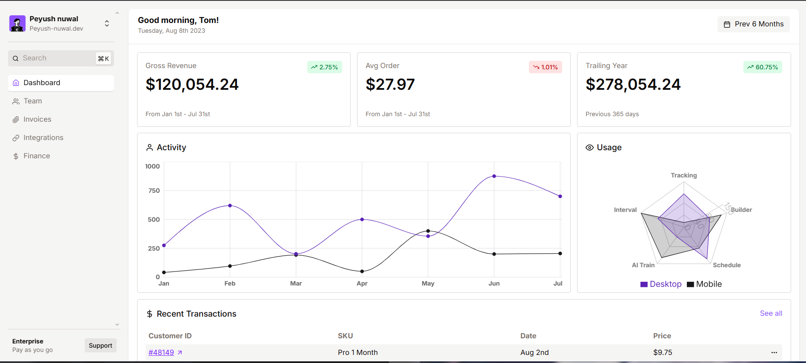
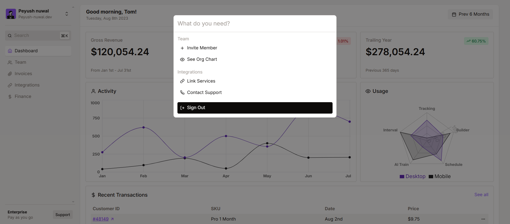
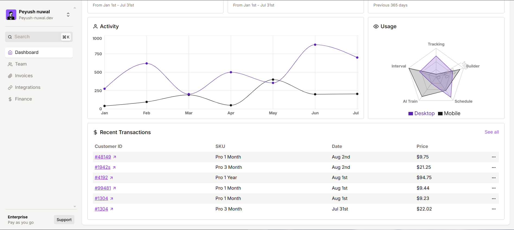

# 💸 Financial Dashboard
🌐 [Live Site](https://financial-dashboard-taupe-one.vercel.app/)

A minimalist and modern financial dashboard built with **React JS** — crafted to visualize usage and transaction data using smooth UI elements and interactive charts.

<div align="center">
  
  
  
</div>

---

### 🚀 Live Demo

> Coming soon... (or deploy on Vercel/Netlify and drop the link here)

---

### ✨ Features

- ⚡ **Command palette (cmdk)** for quick navigation and interaction
- 📊 **Recharts** for clean, responsive data visualizations (Radar, Line, etc.)
- 💳 Recent transactions and usage views
- 🎯 Minimalist design with Tailwind CSS and React Icons
- 💻 Fully responsive — works on desktop and mobile

---


### 🛠️ Tech Stack


---


## 🎥 Demo

Or view the live site:  
🌐 [financial-dashboard-taupe-one.vercel.app/](https://financial-dashboard-taupe-one.vercel.app/)

## 🛠 Installation & Setup

To run this dashboard locally, follow these steps:

1. **Clone the repository**
```bash
git clone https://github.com/peyush-nuwal/financial-dashboard.git
cd financial-dashboard
```

2. **Install dependencies**
```bash
npm install
```

3. **Start the development Server**
```bash
npm run dev
```

4. **Open your browser and navigate to:**
```bash
http://localhost:3000
```

## 📬 Contact

- Portfolio: [https://peyush-nuwal-portfolio.vercel.app/](https://peyush-nuwal-portfolio.vercel.app/)
- LinkedIn: [linkedin.com/in/peyush-nuwal](https://linkedin.com/in/peyush-nuwal)
- Email: piyushnawal19@gmail.com